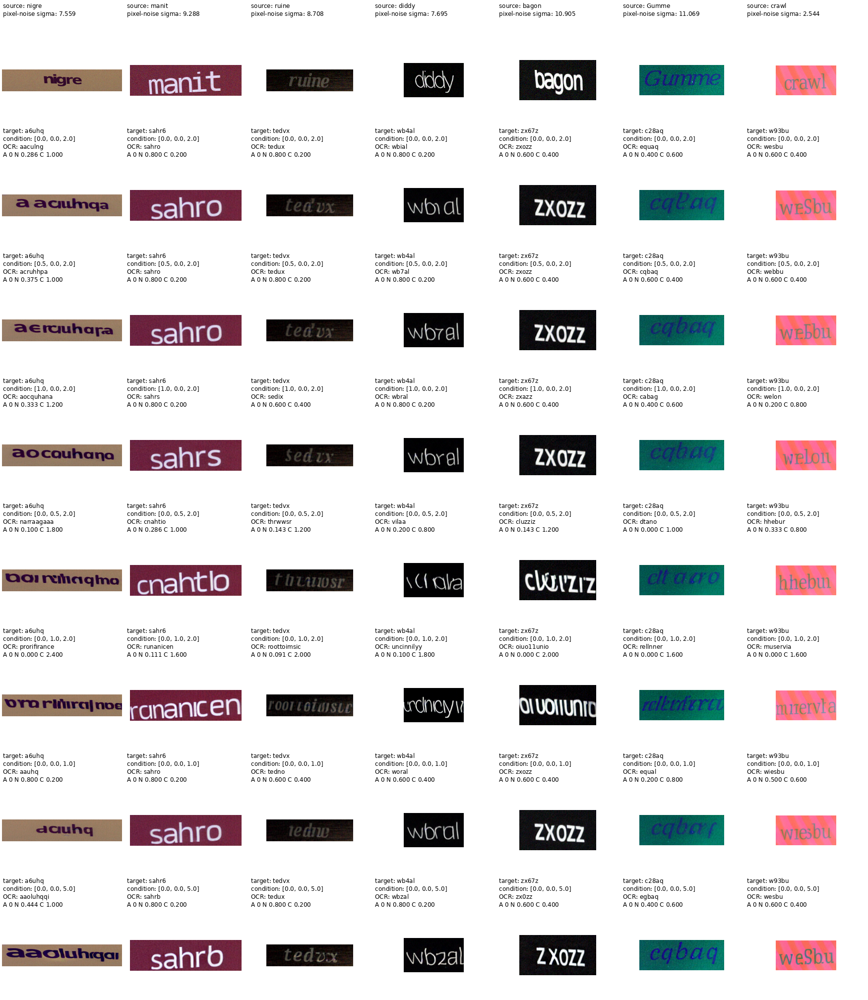

# Instruction

Use TextCtrl + sd1.5 for inference. You will modify glyph features from the glyph encoder.

Take 50 samples of SRNet_Datagen dataset where the source text is 5 characters and add small random noise to each samples. Keep record of the added noise for each samples. 

\* SRNet_Datagen is the same dataset used to train TextCtrl

Next, randomly sample combinations of 5 characters for each images. These strings will be used as a target text for each images.

You will have 3 parameters/modifications. Sweep accross these 3 parameters. You have 5 grids for each parameters. Therefore there should initally be 5*5*5=125 combinations.

## 1. Gaussian noise corruption

For each target text, extract the glyph features from glyph encoder. There will be one vector for each character / tokens. Before feeding this glyph features into SD1.5, add Gaussian noise to these vectors.

$\tilde{g} = g + \epsilon, \qquad \epsilon \sim \mathcal{N}(0, (\alpha\sigma_g)^2)$
- $\sigma_g$ is the std of clean glyph features

You will use 5 scales of gaussian noise: $\alpha=[0, 0.1, 0.3, 0.5, 1]$
- $\alpha=0$: no corruption
- $\alpha=1$: noise standard deviation equals the glyph-feature standard deviation

## 2. Masking

For each target text, extract the glyph features from glyph encoder. There will be one vector for each character / tokens. Before feeding this glyph features into SD1.5, randomly mask certain proportion of each vectors.

Masking proportion: [0, 0.1, 0.3, 0.5, 0.7]
- 0 means do not mask any vectors.
- 0.1 means randomly mask 10% of each vectors.

## 3. Guidance scale

TextCtrl uses a default cfg guidance scale of 2 for the glyph encoder.

Apply 5 different guidance scales: [1, 2, 3, 5, 10]

Apart from these 125 combinations, you will additionally generate samples masking all vectors. This is a case where masking proportion is 1 and the other two parameters (gaussian noise and guidance scale) does not matter. (However just use the combination [0,1,2]) Therefore, there whould be 126 combinations in total.

# Record the results

## CSV

For each combination of parameters, perform text editing of source text to target text. Make sure to store all of these edited images in a folder. Then use OCR to predict the generated text for each generated image. Record mean and std of ACC, NED, CER for each combinations in a csv file.

First column of csv should have scales of Gaussian noise. Second column should have masking proportions. Third column should have guidance scales. Fourth column stores {mean}/{std} of ACC. Fifth column stores {mean}/{std} of NED. Sixth column stores {mean}/{std} of ACC.

There should be 125 rows, one for each combination, and an addtional row for masking all glyph feature vectors.

## Collage

Next, create a collaged image of the generated samples. You will only show 7 samples of following [gaussian noise, masking, guidance] combination.
- [0, 0, 2]: deafult TextCtrl setting
- [0.5, 0, 2]
- [1, 0, 2]
- [0, 0.5, 2]
- [0, 1, 2]: masking all vectors
- [0, 0, 1]
- [0, 0, 5]

First row will show the source image with noise added. Above each images in the first row, label the source text and the scale of random noise added.

Second row will show the edited image with each combinations. Above each images in the second row, label:
1. the target text
2. combinations of scales (e.g. [0, 0, 2])
3. predicted text from OCR
3. ACC, NED, CER

# Results

**1. [Results for all 125 combinations](experiments/glyph_encoder/results/summary.csv)**

**2. Averaged metric for each parameters:**

| Parameter and Value | ACC ↑ (mean/std) | NED ↑ (mean/std) | CER ↓ (mean/std) |
|---|---:|---:|---:|
| `gaussian_noise_scale=0` | 0.084800/0.278584 | 0.391275/0.303569 | 0.881120/0.589111 |
| `gaussian_noise_scale=0.1` | 0.083200/0.276184 | 0.390212/0.304783 | 0.884160/0.586751 |
| `gaussian_noise_scale=0.3` | 0.083200/0.276184 | 0.387543/0.301668 | 0.892640/0.594018 |
| `gaussian_noise_scale=0.5` | 0.070400/0.255820 | 0.371834/0.295091 | 0.918720/0.595867 |
| `gaussian_noise_scale=1` | 0.041600/0.199673 | 0.330529/0.270724 | 0.979200/0.556862 |
| `masking_proportion=0` | 0.178400/0.382849 | 0.628607/0.252375 | 0.434720/0.357741 |
| `masking_proportion=0.1` | 0.148000/0.355100 | 0.575342/0.262559 | 0.530880/0.401226 |
| `masking_proportion=0.3` | 0.036800/0.188270 | 0.401675/0.225902 | 0.808320/0.426852 |
| `masking_proportion=0.5` | 0.000000/0.000000 | 0.171781/0.147089 | 1.256800/0.443844 |
| `masking_proportion=0.7` | 0.000000/0.000000 | 0.093989/0.091291 | 1.525120/0.411389 |
| `guidance_scale=1` | 0.051200/0.220405 | 0.305049/0.285915 | 0.929920/0.533322 |
| `guidance_scale=2` | 0.089600/0.285608 | 0.400578/0.307720 | 0.863520/0.584189 |
| `guidance_scale=3` | 0.095200/0.293491 | 0.414672/0.299920 | 0.869120/0.595737 |
| `guidance_scale=5` | 0.076800/0.266274 | 0.393659/0.298865 | 0.920800/0.612222 |
| `guidance_scale=10` | 0.050400/0.218769 | 0.357435/0.274904 | 0.972480/0.593574 |

## Key Observations

- Out of three parameters, masking the glyph vectors had the most significant effect in degrading the performance
  - This was predictable since adding noise or adjusting guidance scale doesnt completely destroy the information whereas masking vectors does.
  - Masking 70% of glyph vectors bring 85% decrease in NED while increasing glyph guidance x5 (2 to 10) only brings 11% decrease in NED
- TextCtrl tolerates moderate Gaussian corruption. Results remain nearly unchanged through noise scales 0-0.3 which suggests the glyph representation has some local robustness.
- Performance collapses between 30% and 50% masking. Once half the glyph embedding is masked, none of the 50 outputs are exactly correct under any averaged condition.
- Increasing glyph guidance doesn't always bring performance improvement. Default guidance scale for TextCtrl is 2 but 3 seems to perform slightly better.

## Visualization

Each column represents different samples. First row shows original source image + nosie added. Second row and below shows edited image with various parameter combinations. Exact parameter values used is written above each image in the order of [Gauissian noise scale, masking proportion, guidance scale]. 

E.g. [1, 0, 2]: Gaussian corruption scale 1, masking proprtion 0 (no masking), guidance scale 2
- Second row [0, 0, 2] is the default setting for TextCtrl

