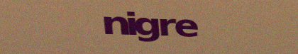
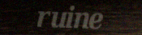
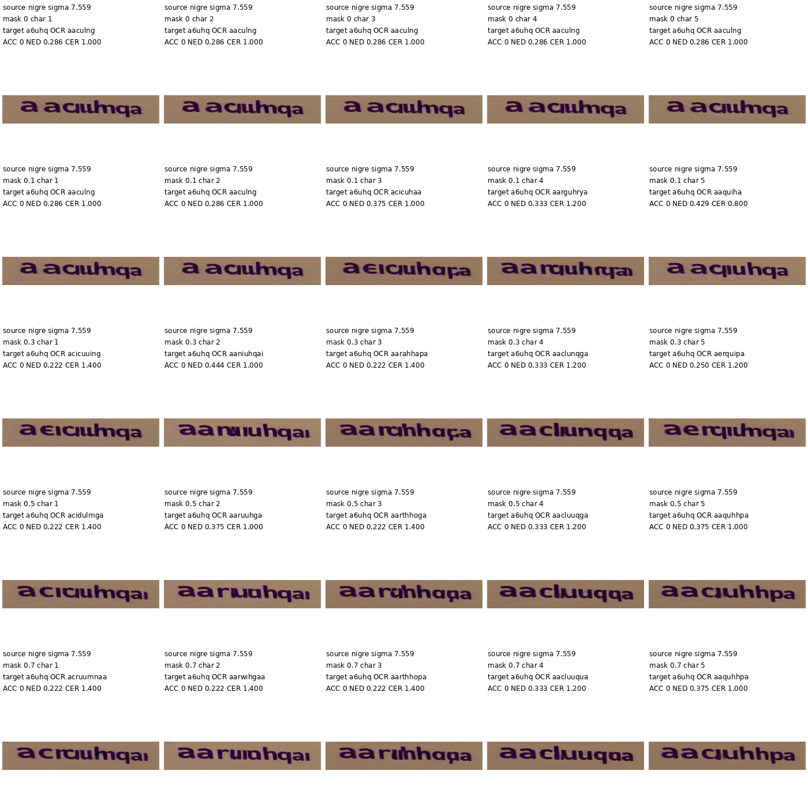

# Instruction

Use TextCtrl + sd1.5 for inference. You will modify glyph features from the glyph encoder.

Take 50 samples of SRNet_Datagen dataset where the source text is 5 characters and add small random noise to each samples. Keep record of the added noise for each samples. 

\* SRNet_Datagen is the same dataset used to train TextCtrl

Next, randomly sample combination of 5 characters for each images. These strings will be used as a target text for each images.

## Dataset

SRNet-Datagen is a synthetic data generator originally built for SRNet (“Editing Text in the Wild”). Its purpose is to generate paired scene-text editing examples where the background and text style are controlled, but the text content can be changed. I used the SRNet Datagen generator to generate 200k samples and we are using 50 samples with a text of 5 characters from this dataset. 

For one generated sample, SRNet-Datagen creates several aligned images: 

$(i_s, i_t, t_{sk}, t_t, t_b, t_f, mask_t)$

| Variable | Meaning                                                                        |
| -------- | ------------------------------------------------------------------------------ |
| (i_s)    | source image: styled source text (A) rendered on a background                  |
| (i_t)    | target text (B) rendered in a standard font on a gray background               |
| (t_{sk}) | skeletonized mask of the target text                                           |
| (t_t)    | target text (B) rendered with the desired style on a gray background           |
| (t_b)    | clean background image                                                         |
| (t_f)    | final target image: styled target text (B) composited onto the same background |
| (mask_t) | binary mask of the target text region                                          |

Example of the samples used:

## Masking

For each target text, extract the glyph features from glyph encoder. There will be one vector for each character / tokens. Before feeding this glyph features into SD1.5, randomly mask certain proportion of the vector of a certain character.

You will use 50 samples to mask the glyph features for each characters and perform the text editing with following 5 scales of masking. For each sample, you mask each character's glyph vectors with 5 different masking proportions.

Masking proportion: [0, 0.1, 0.3, 0.5, 0.7]
- 0 means do not mask any vectors.
- 0.1 means randomly mask 10% of each vectors.

There are 5 character to mask and 5 masking proportions so there would be 25 combinations for a singly source image.

# Record the results

## CSV

For each masking proportions, perform text editing of source text to target text. Make sure to store all of these edited images in a folder. Then use OCR to predict the generated text for each generated image. Record mean and std of ACC, NED, CER for each combinations in a csv file.

First column of csv should have masking proportions. Second to fourth column should have mean/std of ACC, NED, CER across 50 samples. Fifth column should have mean/std of whether the masked character is correctly detected. (0 if not correctly predicted by OCR, 1 if correctly predicted by OCR. Take the mean/std across 50 samples). The next four columns should have mean/std of whether the each of the other four characters are correctly detected.

Also store another csv that records detailed results. (mask proportion, masked character, target text, predicted text by OCR, ACC, NED, CER for each samples)

## Collaged image

Generate this collage for three samples (three source images).

First row will show the source image with noise added. Above each images in the first row, label the source text and the scale of random noise added.

Each row will show edited samples of different masking proportion. Each column will show edited samples of different characters.
For example, second row will show the edited image with masking proportion 0.1. column 1 of the second row will show 10% of first character masked, column 2 of second row will show 10% of second character masked and etc.

Above images in the second row and below, label the target text, predicted text by OCR and ACC, NER, CER.

Overall, There will be 5*5 grid images since there are 5 scales of masking proportions and 5 characters to mask.

# Results

## Evaluation Metrics

Metrics are calculated by detecting the generated text with frozen OCR and then comparing to the true target string.

**Exact Word Accuracy (ACC)**:  
$\text{ACC}(\%) = 100 \cdot \frac{\text{number of exact matches}}{N}.$

**Normalized Edit Distance (NED)**:  
$\text{NED}_i = 1 - \frac{D(\hat{y}_i, y_i)}{\max(|\hat{y}_i|, |y_i|)}.$
- $\hat{y}_i$: detected text by OCR
- $y_i$: ground truth target text
- $D(\hat{y}_i, y_i)$: minimum number of character insertions, deletions and substitutions needed to convert the OCR prediction into the target 

**Character Error Rate (CER)**:  
$\text{CER} = \frac{\sum_i D(\hat{y}_i, y_i)}{\sum_i |y_i|}.$

## Key Observations

check 

| masking_proportion | ACC_mean/std | NED_mean/std | CER_mean/std | masked_character_accuracy_mean/std | other_character_1_accuracy_mean/std | other_character_2_accuracy_mean/std | other_character_3_accuracy_mean/std | other_character_4_accuracy_mean/std | masked_character_index |
|---:|---:|---:|---:|---:|---:|---:|---:|---:|---:|
| <mark>0.0</mark> | <mark>0.220000/0.414246</mark> | <mark>0.666698/0.242729</mark> | <mark>0.368000/0.292192</mark> | <mark>0.780000/0.414246</mark> | <mark>0.680000/0.466476</mark> | <mark>0.660000/0.473709</mark> | <mark>0.480000/0.499600</mark> | <mark>0.580000/0.493559</mark> | <mark>0</mark> |
| 0.0 | 0.220000/0.414246 | 0.666698/0.242729 | 0.368000/0.292192 | 0.680000/0.466476 | 0.780000/0.414246 | 0.660000/0.473709 | 0.480000/0.499600 | 0.580000/0.493559 | 1 |
| 0.0 | 0.220000/0.414246 | 0.666698/0.242729 | 0.368000/0.292192 | 0.660000/0.473709 | 0.780000/0.414246 | 0.680000/0.466476 | 0.480000/0.499600 | 0.580000/0.493559 | 2 |
| 0.0 | 0.220000/0.414246 | 0.666698/0.242729 | 0.368000/0.292192 | 0.480000/0.499600 | 0.780000/0.414246 | 0.680000/0.466476 | 0.660000/0.473709 | 0.580000/0.493559 | 3 |
| 0.0 | 0.220000/0.414246 | 0.666698/0.242729 | 0.368000/0.292192 | 0.580000/0.493559 | 0.780000/0.414246 | 0.680000/0.466476 | 0.660000/0.473709 | 0.480000/0.499600 | 4 |
| <mark>0.1</mark> | <mark>0.220000/0.414246</mark> | <mark>0.672889/0.232806</mark> | <mark>0.368000/0.289441</mark> | <mark>0.740000/0.438634</mark> | <mark>0.700000/0.458258</mark> | <mark>0.640000/0.480000</mark> | <mark>0.460000/0.498397</mark> | <mark>0.620000/0.485386</mark> | <mark>0</mark> |
| 0.1 | 0.220000/0.414246 | 0.675460/0.239501 | 0.360000/0.288444 | 0.700000/0.458258 | 0.780000/0.414246 | 0.680000/0.466476 | 0.460000/0.498397 | 0.580000/0.493559 | 1 |
| 0.1 | 0.220000/0.414246 | 0.689294/0.216448 | 0.352000/0.287221 | 0.640000/0.480000 | 0.780000/0.414246 | 0.720000/0.448999 | 0.540000/0.498397 | 0.640000/0.480000 | 2 |
| 0.1 | 0.220000/0.414246 | 0.666825/0.237323 | 0.376000/0.306307 | 0.500000/0.500000 | 0.740000/0.438634 | 0.660000/0.473709 | 0.620000/0.485386 | 0.620000/0.485386 | 3 |
| 0.1 | 0.240000/0.427083 | 0.663341/0.254259 | 0.372000/0.302020 | 0.580000/0.493559 | 0.720000/0.448999 | 0.700000/0.458258 | 0.640000/0.480000 | 0.500000/0.500000 | 4 |
| <mark>0.3</mark> | <mark>0.200000/0.400000</mark> | <mark>0.667714/0.242935</mark> | <mark>0.376000/0.324074</mark> | <mark>0.680000/0.466476</mark> | <mark>0.660000/0.473709</mark> | <mark>0.660000/0.473709</mark> | <mark>0.480000/0.499600</mark> | <mark>0.660000/0.473709</mark> | <mark>0</mark> |
| 0.3 | 0.140000/0.346987 | 0.632825/0.255080 | 0.412000/0.316000 | 0.580000/0.493559 | 0.740000/0.438634 | 0.640000/0.480000 | 0.480000/0.499600 | 0.540000/0.498397 | 1 |
| 0.3 | 0.160000/0.366606 | 0.632548/0.239321 | 0.436000/0.354830 | 0.500000/0.500000 | 0.720000/0.448999 | 0.700000/0.458258 | 0.480000/0.499600 | 0.520000/0.499600 | 2 |
| 0.3 | 0.120000/0.324962 | 0.598024/0.264371 | 0.460000/0.356090 | 0.280000/0.448999 | 0.720000/0.448999 | 0.660000/0.473709 | 0.620000/0.485386 | 0.600000/0.489898 | 3 |
| 0.3 | 0.180000/0.384187 | 0.617103/0.259244 | 0.420000/0.310483 | 0.460000/0.498397 | 0.700000/0.458258 | 0.660000/0.473709 | 0.640000/0.480000 | 0.520000/0.499600 | 4 |
| <mark>0.5</mark> | <mark>0.120000/0.324962</mark> | <mark>0.588349/0.230281</mark> | <mark>0.472000/0.336476</mark> | <mark>0.400000/0.489898</mark> | <mark>0.620000/0.485386</mark> | <mark>0.620000/0.485386</mark> | <mark>0.460000/0.498397</mark> | <mark>0.640000/0.480000</mark> | <mark>0</mark> |
| 0.5 | 0.040000/0.195959 | 0.570770/0.202253 | 0.476000/0.255781 | 0.260000/0.438634 | 0.780000/0.414246 | 0.580000/0.493559 | 0.380000/0.485386 | 0.440000/0.496387 | 1 |
| 0.5 | 0.080000/0.271293 | 0.548048/0.227803 | 0.520000/0.337046 | 0.100000/0.300000 | 0.720000/0.448999 | 0.700000/0.458258 | 0.460000/0.498397 | 0.500000/0.500000 | 2 |
| 0.5 | 0.060000/0.237487 | 0.543952/0.240588 | 0.508000/0.318019 | 0.100000/0.300000 | 0.660000/0.473709 | 0.660000/0.473709 | 0.560000/0.496387 | 0.620000/0.485386 | 3 |
| 0.5 | 0.000000/0.000000 | 0.554071/0.218522 | 0.504000/0.302628 | 0.180000/0.384187 | 0.700000/0.458258 | 0.640000/0.480000 | 0.620000/0.485386 | 0.520000/0.499600 | 4 |
| <mark>0.7</mark> | <mark>0.080000/0.271293</mark> | <mark>0.562992/0.219356</mark> | <mark>0.488000/0.302417</mark> | <mark>0.280000/0.448999</mark> | <mark>0.600000/0.489898</mark> | <mark>0.640000/0.480000</mark> | <mark>0.480000/0.499600</mark> | <mark>0.680000/0.466476</mark> | <mark>0</mark> |
| 0.7 | 0.040000/0.195959 | 0.525238/0.212297 | 0.528000/0.273525 | 0.140000/0.346987 | 0.760000/0.427083 | 0.540000/0.498397 | 0.360000/0.480000 | 0.440000/0.496387 | 1 |
| 0.7 | 0.040000/0.195959 | 0.524056/0.212585 | 0.552000/0.331204 | 0.040000/0.195959 | 0.740000/0.438634 | 0.640000/0.480000 | 0.480000/0.499600 | 0.480000/0.499600 | 2 |
| 0.7 | 0.060000/0.237487 | 0.549286/0.240293 | 0.504000/0.318094 | 0.100000/0.300000 | 0.680000/0.466476 | 0.680000/0.466476 | 0.540000/0.498397 | 0.620000/0.485386 | 3 |
| 0.7 | 0.000000/0.000000 | 0.526659/0.214015 | 0.540000/0.315595 | 0.080000/0.271293 | 0.700000/0.458258 | 0.660000/0.473709 | 0.620000/0.485386 | 0.500000/0.500000 | 4 |

- Accuracy for the first character of the target text is higher than other characters
  - Sometimes accuracy of the first character is higher than other characters despite being masked (upto masking proportion ~0.3)
- Masking one character does not significantly affect the accuracy of other characters (or even slighly increased the accuracys)

## Visualization

First row shows the original image + noise. Second row and below shows each masking proportions. Each column shows masking each characters.

