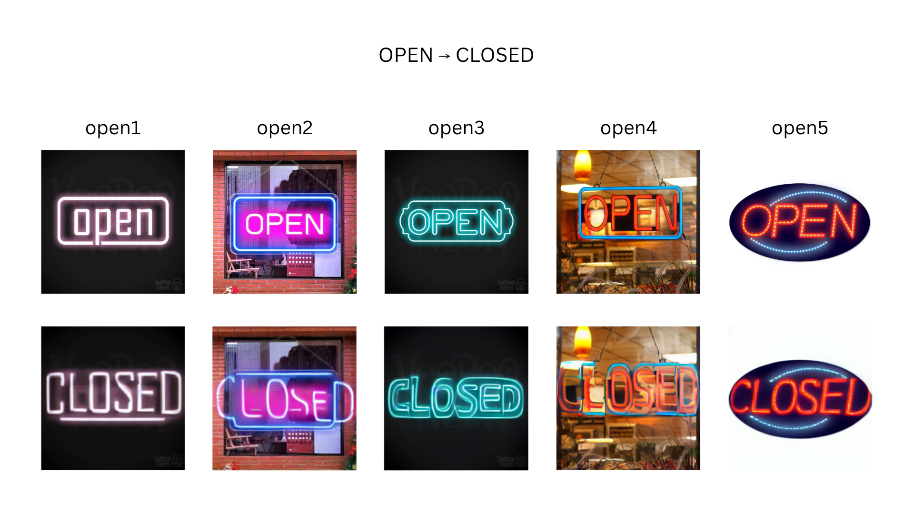
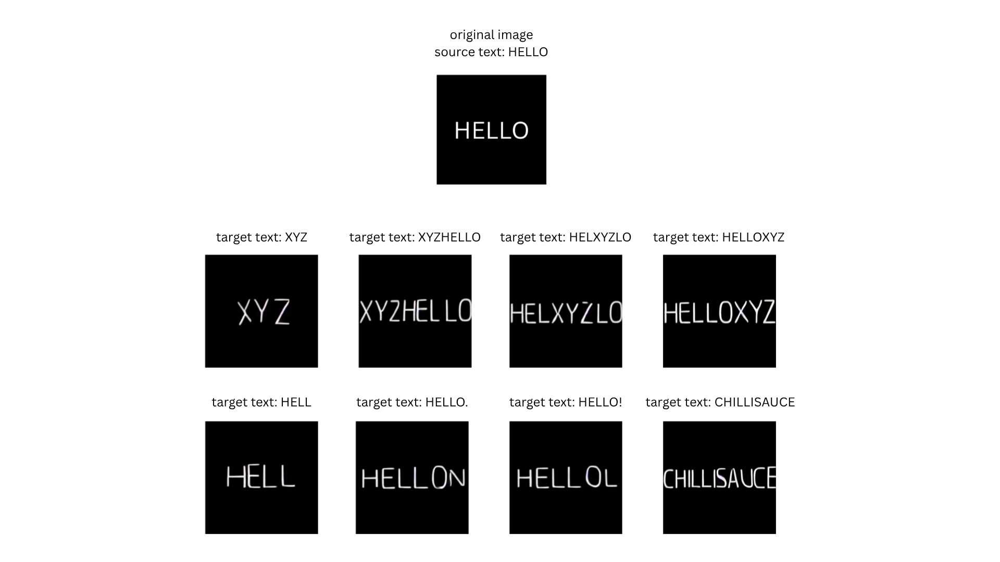
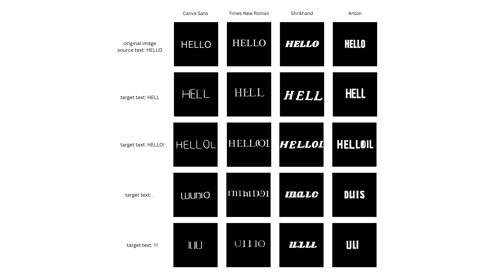
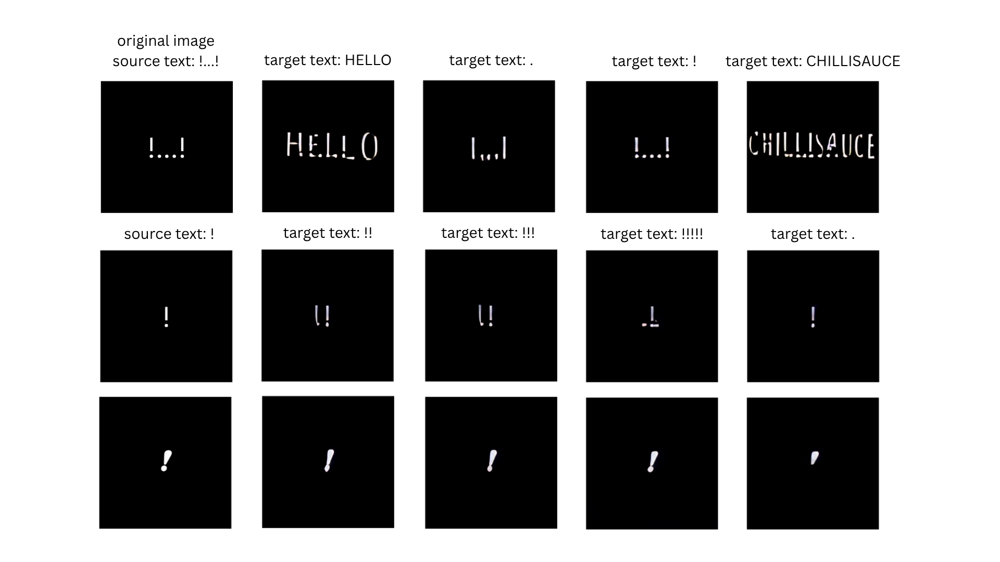

# Introduction

We experiment TextCtrl on SD1.5. Given an image with a text, the model should successfully edit the source text to the target text while preserving the background and text style.

Below are examples of editing 'open' sign in the original image to 'closed'.

# 1. Evaluation text on black background text

Setting: Original image is of size 400*400 with plain black background and white text in the middle. I manually mark the text region with white rectangular box to obtain a mask.

## Editing Basic 'HELLO' Image

I editied the source text 'HELLO' into various target texts. Font of the source text is canva sans which was chosen due to its simple style.

- Model generates rare letters XYZ well
- Model successfully edits the text to longer words (XYZHELLO, HELXYZLO, HELLOXYZ, CHILLISAUCE)
- Model succesfully places XYZ at the start, middle, and end of the source text HELLO
- Model does not generate special characters ! and . well

 

## Comparing results of different fonts

**Does simple font perform better in text editing? Or does thick fonts perform better?**

I use 4 fonts to compare the results: Canva Sans, Times New Roman, Shrikhand, and Anton. Canva Sans is the simplest font with least details.

- Model does not generate special characters well for all fonts (HELLO!, ., !!!)
- Model successfully performs edit to a target text only involving letters for all fonts (HELL)
- Overall there is not much performance difference across these four fonts
  - There are not enough examples so I can't confidently say but from the results below Shrikhand appears to be strongest overall (highest NED with second lowest CER) and Times New Roman appears to be the weakest since its CER is substantially higheer

### Metrics

Metrics are calculated by detecting the generated text with frozen OCR and then comparing to the true target string.

**Exact Word Accuracy (ACC)**:  
$\text{ACC}(\%) = 100 \cdot \frac{\text{number of exact matches}}{N}.$

**Normalized Edit Distance (NED)**:  
$\text{NED}_i = 1 - \frac{D(\hat{y}_i, y_i)}{\max(|\hat{y}_i|, |y_i|)}.$
- $\hat{y}_i$: detected text by OCR
- $y_i$: ground truth target text
- $D(\hat{y}_i, y_i)$: minimum number of character insertions, deletions and substitutions needed to convert the OCR prediction into the target 

**Character Error Rate (CER)**:  
$\text{CER} = \frac{\sum_i D(\hat{y}_i, y_i)}{\sum_i |y_i|}.$

**\* OCR accuracy may be affecting the result; the image may look readable to a person while the OCR model predicts it incorrectly**

| Font            | Word Accuracy (ACC) ↑ | Normalized Edit Distance (NED) ↑ | Character Error Rate (CER) ↓ |
| --------------- | --------------------: | -------------------------------: | ---------------------------: |
| Canva Sans      |                 0.250 |                            0.458 |                        1.792 |
| Times New Roman |                 0.250 |                            0.429 |                        2.250 |
| Shrikhand       |                 0.250 |                            0.458 |                        1.375 |
| Anton           |                 0.250 |                            0.429 |                        1.333 |

## Editing special characters as source text

From previous experiment I found that model does not perform well with special characters as target text. Does the model successfully generate target strings given special characters as source text?

\* Letters [\metric\]: target text is letters (HELLO, CHILLISAUCE)  
\* Special Chars [\metric\]: target text is special characters (!, .)  
\* None of the texts for the below two rows (source text '!') were correctly recognized by OCR

| Source Text | Letters ACC ↑ | Letters NED ↑ | Letters CER ↓ | Special Chars ACC ↑ | Special Chars NED ↑ | Special Chars CER ↓ |
| ----------- | ------------: | ------------: | ------------: | ------------------: | ------------------: | ------------------: |
| `!...!`     |         0.500 |         0.955 |         0.045 |               0.000 |               0.000 |               3.500 |

- Model successfully performs edit if target string is letters, even if source string are special characters. It is still poor at editing the text to special characters even though the source text is special characters.
  - Visual fidelity is worse than when source text was letters but it is still being recognized well by OCR

# 2. Implementation on SD3.5

SD1.5
- Glyph condition: cross attention
- Style condition: UNet feature injection
  - Injected to UNet middle block and skip connection

SD3.5
- Give glyph condition and style condition as the condition for SD3.5 MMDiT
- However I would have to generate my own dataset

## Next Task

**Add noise to image and see how they perform**
- evaulate across 1K samples
- keep 5 source chars and 5 target chars
- 4-5 diff combos of source chars and 4-5 combos of target chars: create confusion matrix
- compare side by side with sd3.5

1. training diffusion model to do this without explicit glyph guidance (no encoders)
- merits of removing glyph encoder vs using
- find holes in previous papers work
- if you train from scratch would it generalize better for special chars
- look for papers that have done this from scratch

2. find a way the glyph representation and t5 representation come close by so you dont have to use glyph encoder
- replace hello to xyz -> representation space of t5 and glyph enocder is diff -> how can we bring this closer

##