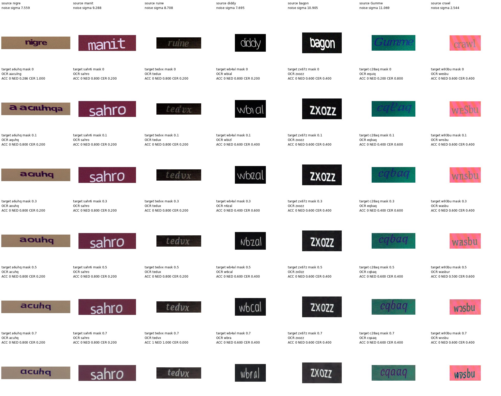
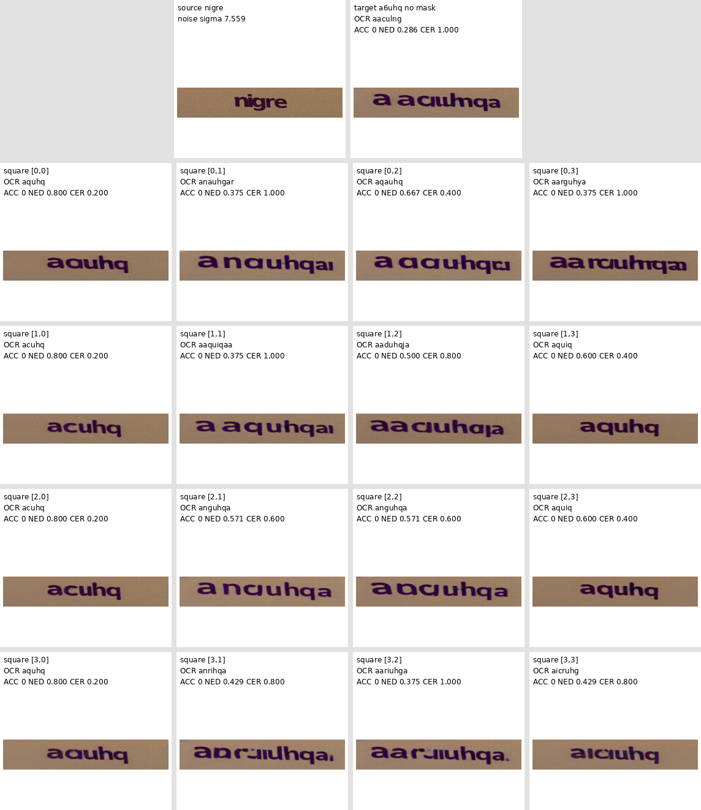

# Instruction

Use TextCtrl + sd1.5 for inference. You will modify style features from the style encoder.

Take 50 samples of SRNet_Datagen dataset where the source text is 5 characters and add small random noise to each samples. Keep record of the added noise for each samples. 

\* SRNet_Datagen is the same dataset used to train TextCtrl

Next, randomly sample combinations of 5 characters for each images. These strings will be used as a target text for each images.

You will complete the following two experiments.

## 1. Masking proportions

From the source image, extract the style features from style encoder. The size of the feature would be [B, 256, 768]. Before feeding this style features into SD1.5, randomly mask the tokens of following proportions.

[0, 0.1, 0.3, 0.5, 0.7]
- 0.1: randomly mask 10% of 256 tokens
- 0.3: randomly mask 30% of 256 tokens

## 2. Regional Masking of Patches

From the source image, extract the style features from style encoder. The size of the feature would be [B, 256, 768]. Before feeding this style features into SD1.5, mask 16 tokens at once. 256 tokens refer to 16\*16 image patches. I want to mask each of the smaller square of size 4\*4 within this 16\*16 patches
- square [0,0] corresponds to row 0-3 and col 0-3: tokens [0, 1, 2, 3, 16, 17, 18, 19, 32, 33, 34, 35, 48, 49, 50, 21]
- square [0,1] corresponds to row 0-3 and col 4-7
- square [1,0] corresponds to row 4-7 and col 0-3
and such

For each samples, you initially wouldnt mask any tokens. Then mask the square [0,0], which corresponds to to the upper left square. Next mask square [0,1] etc. Repeat until you have masked all of the smaller 4*4 patches.

index 0-15: [B, 0, 768]. Next, mask the tokens index 16-31: [B, 1, 768]. etc. Repeat until you have masked until the last token.

# Record the results

## CSV

For each experiments, perform text editing of source text to target text for the 50 samples. Make sure to store all of these edited images in a folder. Then use OCR to predict the generated text for each generated image. Record mean and std of ACC, NED, CER for each combinations in a csv file.

For the first 5 rows (for first experiment) the csv would have would have masking scales [0, 0.1, 0.3, 0.5, 0.7] on the first column. Then column 2, 3, 4 would be {mean}/{std} of ACC, NED, CER. 

For the rows below that, store the masked token indices on the first column. Then the next columns would store their {mean}/{std} of ACC, NED, CER, and the accuracy of each 5 characters. For these rows, you would also have columns 5, 6, 7, 8, 9 which store the accuracy (format {mean}/{std}) of each characters of the target text. (1 if correct, 0 if wrong). 

## Collage

Next, create a collaged images of the generated samples. 

First collage image will have results of masking following proportions of the tokens: [0, 0.1, 0.3, 0.5, 0.7]. 
Show the source images with noise added for the first row. Second row and below indicates masking of different scales. 

Above each images in the first row, label the source text and the scale of random noise added.

Above each images in the second row and below, label:
1. the target text
2. masking proportion
3. predicted text from OCR
3. ACC, NED, CER

Show 7 samples in each columns. Overall the image layout would be 6\*7. (source image + 5 masking proportions, 7 samples). Only one collage image will be stored for the first experiment.

Second collage image will have result of masking each 4*4 patches. Generate separate collage images for three samples, so there would be 3 images stored.

On the top, you will show two images side by side; original source image with noise added, and the edited image with no masking of tokens at all. Above the original source image, label the source text and the scale of random noise added. Ahove the no-masked image, label the target text, predicted text from OCR, ACC, NED, CER. 

Below that, layout 4*4 images which shows the edited result of masking each smaller square patches. e.g. for [0,0] location of the collage, show the editied image of masking square [0,0] (tokens [0, 1, 2, 3, 16, 17, 18, 19, 32, 33, 34, 35, 48, 49, 50, 21]). Above each images in this 4\*4 layout, label masked square (e.g. [0,0]), predicted text from OCR, ACC, NED, CER.

# Results

**[See full CSV](experiments/style_encoder/results/summary.csv)**

| condition | ACC ↑ (mean/std) | NED ↑ (mean/std) | CER ↓ (mean/std) | character_1_accuracy_mean/std | character_2_accuracy_mean/std | character_3_accuracy_mean/std | character_4_accuracy_mean/std | character_5_accuracy_mean/std |
|---:|---:|---:|---:|---:|---:|---:|---:|---:|
| 0.0 | 0.220000/0.414246 | 0.666698/0.242729 | 0.368000/0.292192 | 0.780000/0.414246 | 0.680000/0.466476 | 0.660000/0.473709 | 0.480000/0.499600 | 0.580000/0.493559 |
| 0.1 | 0.240000/0.427083 | 0.706698/0.222080 | 0.316000/0.262572 | 0.760000/0.427083 | 0.740000/0.438634 | 0.700000/0.458258 | 0.540000/0.498397 | 0.760000/0.427083 |
| 0.3 | 0.280000/0.448999 | 0.723714/0.230804 | 0.284000/0.246868 | 0.760000/0.427083 | 0.700000/0.458258 | 0.740000/0.438634 | 0.600000/0.489898 | 0.760000/0.427083 |
| 0.5 | 0.280000/0.448999 | 0.735905/0.205928 | 0.272000/0.218211 | 0.780000/0.414246 | 0.720000/0.448999 | 0.720000/0.448999 | 0.600000/0.489898 | 0.760000/0.427083 |
| 0.7 | 0.280000/0.448999 | 0.732000/0.228421 | 0.268000/0.228421 | 0.780000/0.414246 | 0.760000/0.427083 | 0.700000/0.458258 | 0.640000/0.480000 | 0.780000/0.414246 |

## Evaluation Metrics

Metrics are calculated by detecting the generated text with frozen OCR and then comparing to the true target string.

**Exact Word Accuracy (ACC)**:  
$\text{ACC}(\%) = 100 \cdot \frac{\text{number of exact matches}}{N}.$

**Normalized Edit Distance (NED)**:  
$\text{NED}_i = 1 - \frac{D(\hat{y}_i, y_i)}{\max(|\hat{y}_i|, |y_i|)}.$
- $\hat{y}_i$: detected text by OCR
- $y_i$: ground truth target text
- $D(\hat{y}_i, y_i)$: minimum number of character insertions, deletions and substitutions needed to convert the OCR prediction into the target 

**Character Error Rate (CER)**:  
$\text{CER} = \frac{\sum_i D(\hat{y}_i, y_i)}{\sum_i |y_i|}.$

## Key Observations

- Accuracy of the target text increased as you mask greater proportions of the style encoding
  - From no masking to 70% masking: ACC increased 27%, NED increased 9.6%, CER decreased 27%
- Accuracy of the first character almost did not change (check red) whereas the accracy of fourth and fifth characters significantly increase (check blue) as the masking proportion increased
  - From no masking to 70% masking: first character accuracy did not improve at all, fourth character accuracy increased 33%, fifth character accuracy increased 34%.

**Hypothesis 1: Improvement in accuracy of the target text is due to the source glyph leakage in the style encoder.**
- TextCtrl style representation may contain source glyph information that competes with target glyph. 

more style encoder masking → less source-glyph leakage → less conflict → better target-text reconstruction.

**Hypothesis 2: Replacing the style encoder with a residual extractor between source image and rendered glyph image of standard style may improve the performance of textCtrl.**
- The residual extractor extracts residual between the original source image and rendered glyph image of the same source text (standard style)
- Theoretically this residual attempts to exclude the glyph information of the source text and only extract the style information.
- The residual extractor is trained using same style text pairs:
  - Extract the residual between the source image A and its rendered image A 
  - Use this residual to reconstruct the source image B, from the rendered image B
  - if source images A and C are of a same style than residual of A and its rendered text image should be close to the residual of C and its rendered text image

## Visualization

### Collage 1

Each row indicates different proportions of masking the style encoder features. Each column represents different samples.
- See column 1 (leftmost). Text immeditely improves as you go from no masking to 10% masking. (second row to third row) NED increased from 0.286 to 0.8.

### Collage 2

Two images at the top each shows the source image + noise and edited image without any masking. 4*4 grid of images below shows the result of masking the corresponding patches of style features. e.g. Image in the grid [0,0] is the result of completely masking the [0,0] grid/region of the style features. 
- For this particular sample, masking the leftmost regions (column 1) brings improvement in target text

\* There are 16*16 patches for style features and I divided this into 4\*4 smaller regions. 

